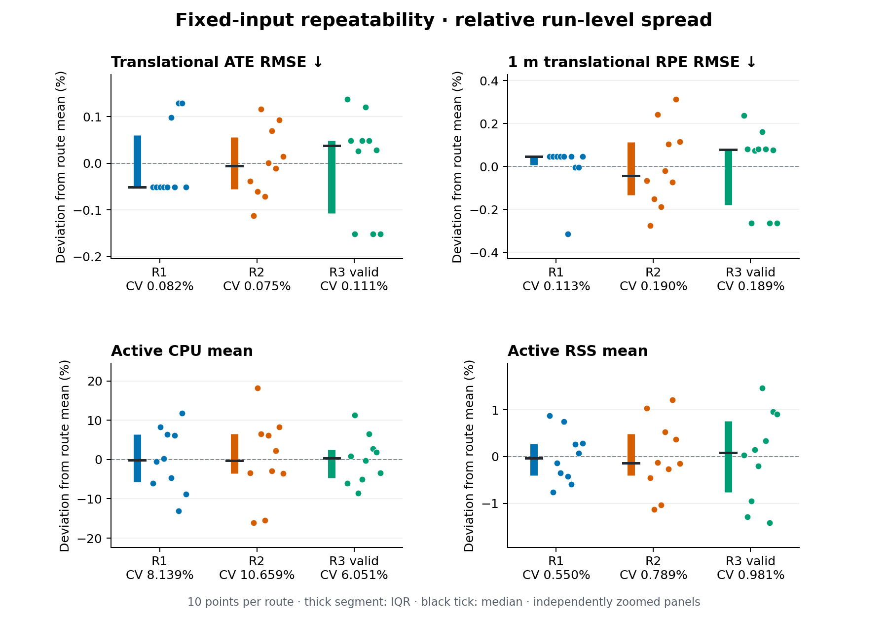

# Static SLAM benchmark — World V0 / R1–R3

**SLAM Toolbox 2.8.5 · ROS 2 Jazzy · TurtleBot3 Burger · Gazebo Sim 8.11.0**

A static baseline for later dynamic-environment studies: compare trajectory accuracy,
map quality and process cost across three routes through World V0. Each route uses
one immutable recorded input and ten fresh SLAM processes running SLAM Toolbox in
**online asynchronous mapping mode**.

This experiment therefore measures **fixed-input repeatability**: the same recorded
sensor and TF data are processed repeatedly by fresh SLAM executions. It does not
represent ten independently simulated robot trajectories.

A **canonical bag** is the single validated and hash-frozen recording selected as
the authoritative input for all repetitions of a route.

## Benchmark at a glance

**30/30 valid trials passed** the frozen execution checks (10/10 per route).
R1 validation pilots are excluded. R3 uses runs 001–009 plus 011: original 010 is
invalid because of concurrent external playback, with all evidence retained in the
[exclusion audit](data/r3_exclusion_audit.json). No experiments were rerun for this report.

| Route | Coverage intent | Nominal / canonical GT length (m) | Route / bag duration (s) | Input / reference scans | Valid cohort |
|---|---|---:|---:|---:|---|
| [R1](../../benchmark/routes/r1.yaml) | Horizontal rectangular loop | 9.50 / 9.578 | 159.866 / 170.884 | 855 / 854 | 004–013 |
| [R2](../../benchmark/routes/r2.yaml) | Complementary vertical/orthogonal coverage | 11.80 / 11.782 | 199.197 / 210.249 | 1052 / 1052 | 001–010 |
| [R3](../../benchmark/routes/r3.yaml) | Repeated central loop with more revisits | 9.50 / 9.539 | 193.312 / 204.313 | 1022 / 1022 | 001–009 + 011 |

## Setup and methodology

Acquire and validate one simulation-time MCAP per route, then freeze its hash.
Replay at 1× with rosbag2 as the sole 100 Hz clock authority into a fresh
**SLAM Toolbox online asynchronous mapper**. Independent Gazebo ground truth is
evaluation-only; SLAM consumes laser scans and robot TF. Save the online trajectory,
final map/graph and SLAM-process resource samples after each run.

Trajectory evaluation uses the SLAM-estimated transform:

`map → base_footprint`

and compares it with independent Gazebo ground truth at corresponding simulation
timestamps.

Because the SLAM `map` frame and Gazebo world frame have arbitrary origins and
orientations, one rigid **SE(2)** alignment is fitted before trajectory evaluation.
The alignment contains translation and rotation only: **no scale correction** is
allowed.

The same alignment is then reused for map scoring against a deterministic,
noise-free Gazebo reference map at 0.05 m resolution. The occupancy map is not
independently shifted or rotated to improve its map score.

Resources cover active playback. See [methodology](../../docs/methodology.md),
[metric conventions](../../docs/metrics.md),
[reference construction](../../docs/reference_maps.md) and
[frozen hashes/commits](../../docs/reproducibility.md#static-benchmark-provenance).

## Metrics

The benchmark uses three main metric families:

**Trajectory metrics** evaluate whether the position and orientation estimated by
SLAM agree with the independent Gazebo trajectory.

**Map metrics** evaluate whether the final SLAM occupancy grid agrees with the
route-specific ideal observed reference map.

**System metrics** measure the computational resources used by the SLAM process
during replay.

All aggregate values reported below are **mean ± sample standard deviation across
10 complete SLAM runs**. The unit of analysis is one complete run, not an individual
trajectory pose.

### Trajectory metrics

Let:

- `Gᵢ` be the Gazebo ground-truth pose at timestamp `i`;
- `Eᵢ` be the SLAM-estimated `map → base_footprint` pose;
- `A` be the single rigid SE(2) alignment applied to the SLAM trajectory.

For translation:

`eᵢ = || trans(AEᵢ) - trans(Gᵢ) ||₂`

For yaw:

`aᵢ = | wrap(yaw(AEᵢ) - yaw(Gᵢ)) |`

| Metric | What it measures | Definition / interpretation |
|---|---|---|
| **Trajectory coverage** | How much of the canonical GT trajectory has a corresponding SLAM pose estimate. | `associated SLAM–GT samples / canonical GT samples`. Accuracy values are conditional on this coverage, so coverage should be considered together with ATE/RPE. Higher is better. |
| **ATE RMSE** | Global translational accuracy of the estimated trajectory. | Compute the XY position error `eᵢ` at every associated timestamp, then `ATE RMSE = √mean(eᵢ²)`. Squaring gives larger errors more influence. Lower is better. |
| **ATE median** | Typical global translational error. | Median of all per-pose XY errors. It is less affected by occasional large deviations than RMSE. Lower is better. |
| **ATE p95** | Upper-tail global position error. | The 95th percentile of the XY errors. Approximately 95% of evaluated trajectory samples have error at or below this value. Lower is better. |
| **Yaw APE RMSE / median** | Global orientation accuracy. | Absolute wrapped difference between estimated and GT yaw. RMSE summarizes overall heading error, while the median represents typical heading error. Lower is better. |
| **1 m translational RPE** | Local translational drift. | Compare estimated and GT relative motion over trajectory intervals separated by exactly 1 m of GT arc length. For `F = (Gᵢ⁻¹Gⱼ)⁻¹(Eᵢ⁻¹Eⱼ)`, use the translational component of `F` and report RMSE. Lower is better. |
| **1 m rotational RPE** | Local rotational drift. | Uses the same 1 m relative-motion comparison as translational RPE, but evaluates the yaw component of `F`. Lower means less local heading drift. |

### How to read ATE, APE and RPE

These metrics answer different questions.

**ATE** asks:

> How close is the estimated global trajectory to the true trajectory?

It evaluates the robot's global XY position after one rigid trajectory alignment.

**Yaw APE** asks:

> How close is the estimated global heading to the true heading?

It evaluates absolute orientation error over the trajectory.

**RPE** asks:

> How accurately does SLAM estimate the robot's motion locally?

The benchmark evaluates relative motion over intervals of exactly 1 m of
ground-truth travel.

A route can therefore have a relatively low ATE while having a higher RPE.
This is not contradictory. Local motion error can differ from global trajectory
consistency, particularly when later SLAM corrections modify the global estimate.

### Map metrics

Map evaluation compares the final SLAM occupancy grid against the route-specific
ideal observed reference map.

Only cells observed in the reference map are scored. Reference unknown cells are
excluded. If the SLAM map is unknown or outside its map extent at a scored reference
cell, it counts as not occupied.

For occupied cells:

- **TP**: SLAM occupied and reference occupied;
- **FP**: SLAM occupied but reference not occupied;
- **FN**: reference occupied but SLAM not occupied.

| Metric | What it measures | Definition / interpretation |
|---|---|---|
| **Occupied precision** | How reliable SLAM's occupied predictions are. | `TP / (TP + FP)`. Low precision indicates more cells falsely labelled as occupied. Higher is better. |
| **Occupied recall** | How much of the expected occupied structure SLAM recovered. | `TP / (TP + FN)`. Low recall indicates more expected occupied cells are missing. Higher is better. |
| **F1 score** | Balance between occupied precision and recall. | `2TP / (2TP + FP + FN)`. A useful combined occupancy score, but it does not reveal whether disagreement comes mainly from false occupied cells or missed occupied cells. Higher is better. |
| **IoU** | Direct overlap between estimated and reference occupied-cell sets. | `TP / (TP + FP + FN)`. It measures occupied-cell intersection relative to occupied-cell union. Higher is better. |
| **Symmetric boundary distance** | Geometric displacement between SLAM and reference obstacle boundaries. | Extract occupied boundaries from both maps, find nearest-boundary distances in both directions and pool them. Report mean, median and p95. Lower is better. |

### How to read the map metrics

Precision, recall, F1 and IoU compare maps **cell by cell**.

The frozen map resolution is:

`0.05 m = 50 mm`

This means that even a geometrically accurate wall shifted by one grid cell can
generate both false-positive and false-negative cells, reducing F1 and IoU.

Boundary distance complements these occupancy metrics by asking a different
question:

> How far apart are the obstacle boundaries geometrically?

For example, a boundary p95 of `50 mm` means that 95% of the pooled boundary
samples are no farther than one 5 cm map cell from the nearest corresponding
boundary.

Therefore F1/IoU and boundary distance should be interpreted together. A lower
cell-overlap score does not necessarily imply a proportionally large geometric
mapping error.

### System metrics

| Metric | What it measures | Definition / interpretation |
|---|---|---|
| **CPU mean** | Average processor demand of the SLAM process during active replay. | Based on process CPU time divided by wall time. `100%` corresponds to one fully used logical CPU. The reported mean is time-weighted. |
| **CPU peak** | Largest sampled processor demand. | Maximum sampled CPU value during active playback. Sampling may miss extremely short peaks. |
| **RSS mean** | Average resident memory used by the SLAM process. | Resident Set Size measures process memory currently resident in RAM. The reported mean is time-weighted. |
| **RSS peak** | Largest sampled resident memory usage. | Maximum sampled RSS during active playback. |
| **Real-time factor** | Whether bag replay maintained the intended 1× rate. | `simulation-time span / wall-time span`. A value near `1.0` confirms approximately real-time playback. This is a playback sanity check, **not a maximum SLAM-throughput benchmark**. |

CPU and memory measurements are host- and workload-dependent. They are useful for
controlled comparisons within this benchmark, but should not be interpreted as
universal hardware requirements.

### Repeatability

Each route processes the **same canonical bag ten times** using ten fresh SLAM
processes.

The repeated runs therefore quantify execution repeatability under fixed input,
rather than variability caused by different sensor realizations or different robot
trajectories.

For a run-level metric `x`:

`CV = 100 × SD(x) / mean(x)`

The coefficient of variation expresses run-to-run standard deviation relative to
the metric mean.

Smaller CV means the metric is more repeatable.

**CV measures consistency, not accuracy.**

An algorithm could produce the same inaccurate result every run and therefore have
a very small CV.

The repeatability figure also shows each run's relative deviation from its route mean:

`dᵢ = 100 × (xᵢ / mean(x) - 1)`

A value of `0%` means that run equals the route mean for that metric.

### Statistical summaries

For every route:

`n = 10 complete SLAM runs`

The unit of analysis is **one complete SLAM execution**. Thousands of individual
trajectory samples are not treated as thousands of independent experimental runs.

Tables report:

`mean ± sample standard deviation`

Figures show all ten run-level values together with the median and interquartile
range (IQR).

The frozen JSON reports additionally retain individual run values, extrema,
median/IQR and bootstrap 95% confidence intervals based on 20,000 run-level
resamples.

These bootstrap intervals describe **fixed-input run-to-run repeatability**.
They should not be interpreted as confidence intervals for performance in other
routes, environments, robots or real-world conditions.

For each route, 10/10 valid trials passed the frozen execution checks. The Wilson
95% interval for 10 successes out of 10 is 72.25–100%. This does not imply that
the true success probability is known to be exactly 100%.

## Trajectory results

| Metric | R1 | R2 | R3 valid |
|---|---:|---:|---:|
| Coverage (%) | 99.761 ± 0.000 | 99.895 ± 0.000 | 99.892 ± 0.000 |
| ATE RMSE (mm) | 11.700 ± 0.010 | 14.599 ± 0.011 | 10.908 ± 0.012 |
| ATE median (mm) | 12.387 ± 0.010 | 12.520 ± 0.044 | 10.559 ± 0.032 |
| ATE p95 (mm) | 17.503 ± 0.004 | 24.870 ± 0.006 | 17.457 ± 0.011 |
| Yaw APE RMSE (mrad) | 4.437 ± 0.006 | 4.476 ± 0.003 | 7.566 ± 0.009 |
| Yaw APE median (mrad) | 2.246 ± 0.012 | 1.800 ± 0.003 | 5.688 ± 0.009 |
| 1 m translation RPE RMSE (mm) | 13.744 ± 0.016 | 14.044 ± 0.027 | 16.487 ± 0.031 |
| 1 m rotation RPE RMSE (mrad) | 6.365 ± 0.005 | 3.428 ± 0.002 | 7.062 ± 0.005 |


[Vector figure](assets/pose_distributions.svg)

## Map results

Each route has its own observed reference domain. Unknown reference cells are
excluded; unknown/out-of-map SLAM cells count as not occupied. Map alignment is
never refitted. Boundary distances pool both directions with point-count weighting.

| Metric | R1 | R2 | R3 valid |
|---|---:|---:|---:|
| Precision | 0.849835 ± 0.000000 | 0.837539 ± 0.000000 | 0.830225 ± 0.000834 |
| Recall | 0.607311 ± 0.000000 | 0.611751 ± 0.000000 | 0.581961 ± 0.000585 |
| F1 | 0.708391 ± 0.000000 | 0.707057 ± 0.000000 | 0.684270 ± 0.000688 |
| IoU | 0.548456 ± 0.000000 | 0.546859 ± 0.000000 | 0.520070 ± 0.000794 |
| Boundary mean (mm) | 24.237 ± 0.000 | 30.198 ± 0.000 | 23.797 ± 0.063 |
| Boundary median (mm) | 0.000 ± 0.000 | 0.000 ± 0.000 | 0.000 ± 0.000 |
| Boundary p95 (mm) | 50.000 ± 0.000 | 50.000 ± 0.000 | 50.000 ± 0.000 |


[Vector figure](assets/map_distributions.svg)

## System results

CPU and RSS refer only to the SLAM process during active playback. Peaks are
sampled at approximately 0.5 s intervals; 100% CPU represents one logical CPU.

| Metric | R1 | R2 | R3 valid |
|---|---:|---:|---:|
| Active CPU mean (%) | 4.863 ± 0.396 | 4.889 ± 0.521 | 5.206 ± 0.315 |
| Active CPU peak (%) | 14.366 ± 0.780 | 14.364 ± 1.220 | 14.755 ± 0.978 |
| Active RSS mean (MiB) | 46.420 ± 0.255 | 46.953 ± 0.371 | 46.681 ± 0.458 |
| Active RSS peak (MiB) | 46.821 ± 0.302 | 47.337 ± 0.390 | 47.009 ± 0.503 |
| Real-time factor | 0.999998 ± 0.000002 | 1.000001 ± 0.000001 | 1.000001 ± 0.000001 |


[Vector figure](assets/system_distributions.svg)

## Repeatability and diagnostics

Relative deviations below normalize each metric by its own route mean; labels
report sample CV. These are presentation summaries of the same ten frozen values,
not new experimental metrics or changed evaluation rules.

CPU varies more than pose scores; RSS varies less than CPU. R1/R2 map scores are
identical across runs.



[Vector figure](assets/repeatability.svg)

Constant diagnostics remain in the table.

**Graph nodes are not processed scans.**

Observed scans come from an independent `/scan` topic monitor. They confirm that
the scan messages were present during replay, but they do **not** prove that every
scan generated a SLAM update.

Exact processed/skipped scan counts are unavailable with the current instrumentation.
Throttled MessageFilter logs also do not provide exact scan-rejection totals.

| Metric | R1 | R2 | R3 valid |
|---|---:|---:|---:|
| Graph nodes | 12 ± 0 | 13 ± 0 | 10 ± 0 |
| Graph edges | 14 ± 0 | 14 ± 0 | 13 ± 0 |
| Observed scans | 855 ± 0 | 1052 ± 0 | 1022 ± 0 |
| MessageFilter drop log lines | 1 ± 0 | 0 ± 0 | 0 ± 0 |
| Queue-full log lines¹ | 0 ± 0 | 0 ± 0 | 0 ± 0 |

¹ Queue-full lines are a subset of MessageFilter lines, not additional rejections.

## Cross-route interpretation

- **Global accuracy and local drift differ.** R3 has the lowest translational ATE,
  but the highest yaw APE and both 1 m RPE errors. R2 has the highest ATE yet the
  lowest rotational RPE. Revisits alone neither guarantee accuracy nor prove loop closure.
- **Map scores describe different properties.** R1/R2 have similar F1; R2 recovers
  slightly more occupied truth but has larger mean boundary distance. R3 has lower
  F1 despite the smallest mean boundary distance. Observed domains differ by route.
- **Execution is stable for fixed inputs.** Pose-score spread is small relative to
  route differences; resource variability is more noticeable. This is descriptive,
  not a causal test of route geometry or a universal compute requirement.

## Limitations

One static world and one simulated realization per route limit generalization.

Errors are conditional on trajectory coverage and use online
`map → base_footprint` TF estimates, not retrospectively optimized trajectories.

R1's first scan precedes odometry TF by about 20 ms. It also lacks a GT
interpolation bracket and is omitted only from reference-map generation. Startup
data remain unchanged.

All canonical scan messages are replayed and independently observed on `/scan`,
but the current instrumentation cannot determine the exact number that SLAM Toolbox
internally used for scan matching or mapping updates.

Exact processed/skipped scan counts and exact loop-closure events are unavailable
from the current interfaces.

The ideal observed reference retains Gazebo rendering precision and 5 cm grid
quantization. Grid phase therefore affects exact-cell occupancy metrics.

CPU and memory measurements are host dependent, and sampled peaks may miss very
short resource spikes.

Runtime success alone does not establish experimental validity, as demonstrated by
the excluded R3 trial.

## Data and figure reproduction

Pose/system:

[R1](data/r1_pose_system.json) ·
[R2](data/r2_pose_system.json) ·
[R3 valid](data/r3_pose_system.json)

Maps:

[R1](data/r1_map.json) ·
[R2](data/r2_map.json) ·
[R3 valid](data/r3_map.json)

The [source manifest](data/source_manifest.json) preserves original paths and hashes.
[Reproducibility documentation](../../docs/reproducibility.md) records frozen identity
and the exclusion audit.

Raw experiment artifacts remain unchanged and gitignored.

From the repository root, regenerate only PNG/SVG figures with NumPy/Matplotlib:

```bash
python3 reports/static_benchmark/render_plots.py
