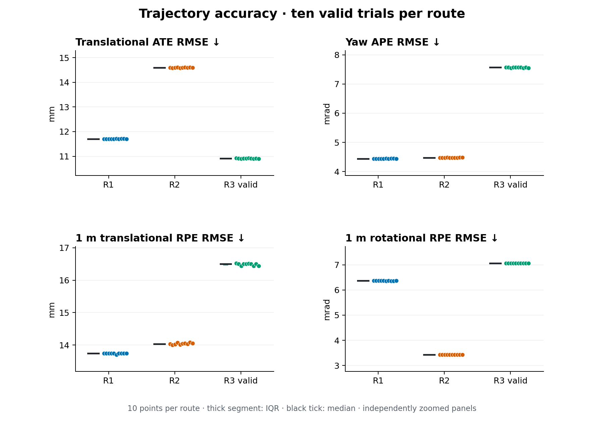
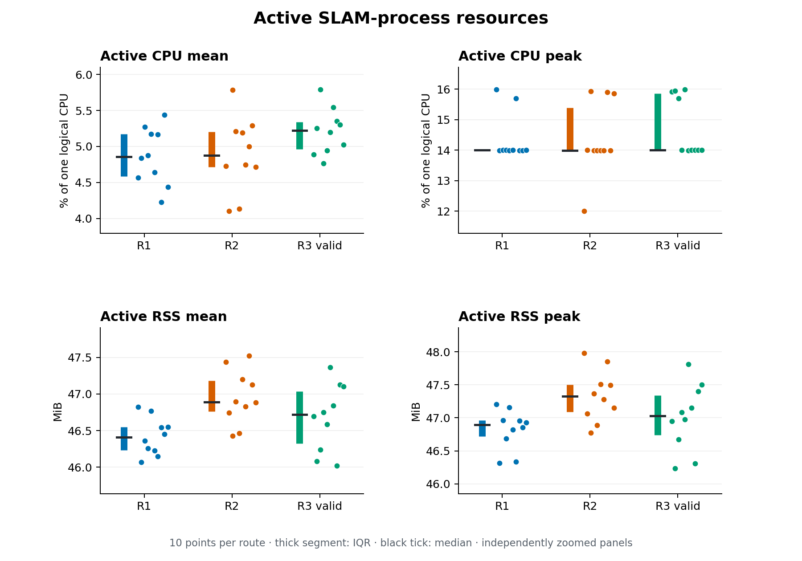
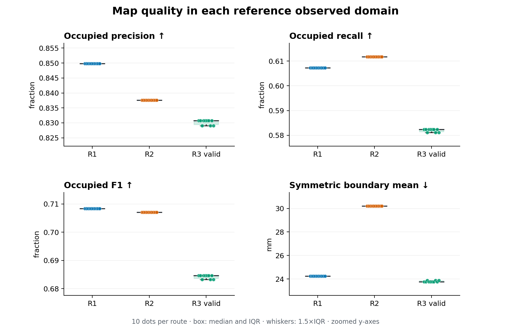

# Static SLAM benchmark — World V0 / R1–R3

**SLAM Toolbox 2.8.5 · ROS 2 Jazzy · TurtleBot3 Burger · Gazebo Sim 8.11.0**

To establish a reproducible static baseline before studying dynamic objects or structural change, this benchmark compares three routes through the same World V0 using **10 valid fresh SLAM processes per route**, each replaying one immutable canonical bag. It measures fixed-input execution repeatability, not ten independently simulated trajectories.

**Cohorts:** R1 `run_004`–`run_013`; R2 `run_001`–`run_010`; R3 `run_001`–`run_009` plus `run_011`. All 30 valid trials passed the frozen run checks. R3 original `run_010` is invalid/excluded following confirmed concurrent external rosbag playback; its outputs and original reports remain intact. Exactly one user-authorized replacement was made. See the [exclusion audit](data/r3_exclusion_audit.json) and [current valid cohort](data/r3_valid_cohort.json).

## Test pipeline

1. **Acquire once per route:** fresh World V0 launch, unchanged GT-controlled stop-and-turn controller, stationary intervals before/after motion; final position ≤15 mm and yaw error ≤0.015 rad. Initial settling: ≥5 simulation seconds with ≤5 mm XY displacement and no time reset/abnormal jump. Record MCAP using simulation time, without recording `/clock`.
2. **Validate and freeze:** topic counts/rates, headers, GT continuity, route/final pose and TF replay checks; hash the canonical bag. GT comes directly from Gazebo entity poses with its simulation timestamp, independently of `/odom` and TF.
3. **Repeat SLAM:** fresh asynchronous online mapper; `map/odom/base_footprint`, `/scan`, simulation time, maximum laser range 3.5 m; remaining installed baseline parameters unchanged. Replay only `/scan`, `/odom`, `/tf`, `/tf_static`, `/ground_truth/pose` at 1× with generated 100 Hz `/clock` and 3 s delay. GT is evaluation-only. Allow 6 wall seconds after playback, then save grid/graph and stop.
4. **Evaluate poses/resources:** sample online `map → base_footprint` at GT stamps; exact integer-nanosecond association and one rigid SE(2) positional fit, **no scale correction**. Compute 1 m GT-arc-length RPE; primary resources cover first-to-last received replay clock using only the SLAM PID.
5. **Evaluate maps offline:** twice generate the same noise-free Gazebo lidar reference from canonical GT scan poses; verify identical occupancy hashes. Score only observed reference cells, using each run’s existing trajectory alignment—no separate map registration.

## Routes and canonical inputs

All routes target nominal start/finish `(−2.00, −0.50)` m and final yaw 0, subject to the stated tolerances. Limits: 0.10 m/s, 0.30 rad/s; accelerations 0.10 m/s² and 0.30 rad/s². Coordinates are in Gazebo world frame.

| Route | Coverage intent | Nominal / canonical GT length (m) | Route / bag duration (s) | Input / reference scans | Valid cohort |
|---|---|---:|---:|---:|---|
| [R1](../../benchmark/routes/r1.yaml) | Horizontal rectangular loop | 9.50 / 9.578 | 159.866 / 170.884 | 855 / 854 | 004–013 |
| [R2](../../benchmark/routes/r2.yaml) | Complementary vertical/orthogonal coverage | 11.80 / 11.782 | 199.197 / 210.249 | 1052 / 1052 | 001–010 |
| [R3](../../benchmark/routes/r3.yaml) | Repeated central loop with more revisits | 9.50 / 9.539 | 193.312 / 204.313 | 1022 / 1022 | 001–009 + 011 |

## Metric definitions

Let `Gᵢ` be GT poses, `Eᵢ` estimates, and `A` the fitted rigid SE(2). Translation errors are `eᵢ = ‖trans(AEᵢ) − trans(Gᵢ)‖₂`; yaw errors are `aᵢ = abs(wrap(yaw(AEᵢ) − yaw(Gᵢ)))`. `Qₚ` denotes a linear-interpolated quantile.

| Metric | Definition / formula | Units | Interpretation |
|---|---|---|---|
| Valid-trial success | `N_pass / N_valid` under frozen artifact/runtime checks | % | Higher; does not enforce complete trajectory coverage or an accuracy threshold. |
| Trajectory coverage | `N_exactly_associated / N_full_canonical_GT` | % | Higher; errors below are conditional on covered samples. |
| Translational ATE | RMSE `√mean(e²)`; median `Q₀.₅(e)`; p95 `Q₀.₉₅(e)` | mm | Lower global position error after SE(2) alignment. |
| Yaw APE | RMSE `√mean(a²)`; median `Q₀.₅(a)` | mrad | Lower orientation error; yaw is excluded from alignment fitting. |
| 1 m RPE | `Dg = Gᵢ⁻¹Gⱼ`, `De = Eᵢ⁻¹Eⱼ`, `F = Dg⁻¹De`; RMSE of `‖trans(F)‖₂` and `abs(wrap(yaw(F)))` | mm / mrad | Lower local drift over exactly 1 m GT arc length; interpolate endpoint XY/shortest yaw, require continuous association, overlapping pairs. |
| CPU mean / peak | Interval CPU `100 Δ(utime+stime)/Δt`; time-weighted active mean and sampled maximum | % of one logical CPU | Process-specific compute cost; 100% is one full logical CPU. |
| RSS mean / peak | Time-weighted left-held resident memory / sampled active maximum | MiB | Process memory footprint; sampling ≈0.5 s can miss brief peaks. |
| Real-time factor | `Δt_sim / Δt_wall` during received playback clock | ratio | Near 1 confirms playback pacing, not independent maximum SLAM throughput. |
| Graph / scan diagnostics | Final marker nodes/edges; independent `/scan` monitor count; MessageFilter/queue log-line counts | count | Descriptive; nodes are **not processed scans**, and throttled logs are not exact rejection totals. |
| Occupied precision / recall | `TP/(TP+FP)` / `TP/(TP+FN)` | fraction | Higher; respectively occupied-label correctness and occupied-truth recovery. |
| Occupied F1 / IoU | `2TP/(2TP+FP+FN)` / `TP/(TP+FP+FN)` | fraction | Higher occupied agreement within the reference observed domain. |
| Symmetric boundary distance | Pool nearest-neighbor distances `B_ref→B_map` and `B_map→B_ref`; report mean, median, p95 | mm | Lower; point-count-weighted pooled distances, not equal weighting of the two directional means. |

## Pose and system aggregates

Values are **mean ± sample SD across ten run-level values**. All individual values, median/IQR, extrema and percentile bootstrap 95% CIs are retained in the linked JSON snapshots. Bootstrap uses 20,000 run-level resamples with frozen seeds; success uses a Wilson interval (10/10: 72.25–100%).

| Metric | R1 | R2 | R3 valid |
|---|---:|---:|---:|
| Coverage (%) | 99.761 ± 0.000 | 99.895 ± 0.000 | 99.892 ± 0.000 |
| ATE RMSE (mm) | 11.700 ± 0.010 | 14.599 ± 0.011 | 10.908 ± 0.012 |
| ATE median (mm) | 12.387 ± 0.010 | 12.520 ± 0.044 | 10.559 ± 0.032 |
| ATE p95 (mm) | 17.503 ± 0.004 | 24.870 ± 0.006 | 17.457 ± 0.011 |
| Yaw APE RMSE (mrad) | 4.437 ± 0.006 | 4.476 ± 0.003 | 7.566 ± 0.009 |
| Yaw APE median (mrad) | 2.246 ± 0.012 | 1.800 ± 0.003 | 5.688 ± 0.009 |
| 1 m translation RPE RMSE (mm) | 13.744 ± 0.016 | 14.044 ± 0.027 | 16.487 ± 0.031 |
| 1 m rotation RPE RMSE (mrad) | 6.365 ± 0.005 | 3.428 ± 0.002 | 7.062 ± 0.005 |
| Active CPU mean (%) | 4.863 ± 0.396 | 4.889 ± 0.521 | 5.206 ± 0.315 |
| Active CPU peak (%) | 14.366 ± 0.780 | 14.364 ± 1.220 | 14.755 ± 0.978 |
| Active RSS mean (MiB) | 46.420 ± 0.255 | 46.953 ± 0.371 | 46.681 ± 0.458 |
| Active RSS peak (MiB) | 46.821 ± 0.302 | 47.337 ± 0.390 | 47.009 ± 0.503 |
| Real-time factor | 0.999998 ± 0.000002 | 1.000001 ± 0.000001 | 1.000001 ± 0.000001 |
| Graph nodes | 12 ± 0 | 13 ± 0 | 10 ± 0 |
| Graph edges | 14 ± 0 | 14 ± 0 | 13 ± 0 |
| Observed scans | 855 ± 0 | 1052 ± 0 | 1022 ± 0 |
| MessageFilter drop log lines | 1 ± 0 | 0 ± 0 | 0 ± 0 |
| Queue-full log lines¹ | 0 ± 0 | 0 ± 0 | 0 ± 0 |

¹ Queue-full lines are a subset of the MessageFilter total, not an additional disjoint rejection count.

## Map aggregates

Each route is scored against its **own observed reference domain**. Reference unknown cells are excluded; unknown/out-of-map SLAM cells count as not occupied. Source labels use containing-cell sampling at inverse-aligned reference cell centers. Boundaries use four-neighbor occupied cells adjacent to a nonoccupied cell inside that domain.

| Metric | R1 | R2 | R3 valid |
|---|---:|---:|---:|
| Precision | 0.849835 ± 0.000000 | 0.837539 ± 0.000000 | 0.830225 ± 0.000834 |
| Recall | 0.607311 ± 0.000000 | 0.611751 ± 0.000000 | 0.581961 ± 0.000585 |
| F1 | 0.708391 ± 0.000000 | 0.707057 ± 0.000000 | 0.684270 ± 0.000688 |
| IoU | 0.548456 ± 0.000000 | 0.546859 ± 0.000000 | 0.520070 ± 0.000794 |
| Boundary mean (mm) | 24.237 ± 0.000 | 30.198 ± 0.000 | 23.797 ± 0.063 |
| Boundary median (mm) | 0.000 ± 0.000 | 0.000 ± 0.000 | 0.000 ± 0.000 |
| Boundary p95 (mm) | 50.000 ± 0.000 | 50.000 ± 0.000 | 50.000 ± 0.000 |

Plots show all ten run values with deterministic horizontal offsets for visibility (not measurement noise). Boxes show median/IQR and 1.5×IQR whiskers; y-axes are zoomed. Collapsed boxes are genuine identical values. SVG versions are provided alongside PNGs. Regenerate figures only with `python3 render_plots.py` (NumPy/Matplotlib); the script reads the included frozen JSON snapshots.

## Cross-route findings

- **Global and local errors differ:** R3 has the lowest translational ATE RMSE (10.908 mm), but the largest yaw APE and translational/rotational 1 m RPE. R2 has the highest ATE RMSE (14.599 mm) yet the lowest rotational RPE (3.428 mrad). More revisits do not establish better performance or prove loop closure.
- **Map trade-offs:** R1 and R2 have similar F1 (0.7084 and 0.7071); R2 has slightly higher recall but larger mean boundary distance. R3 has lower F1 (0.6843) despite the smallest mean boundary distance. Occupied completeness and geometric boundary proximity measure different properties. These are descriptive comparisons across different observed domains.
- **Stable fixed-input behavior:** pose-score SDs are small, and R1/R2 map-score distributions collapse. Active CPU averages are about 4.86–5.21% of one logical CPU and RSS about 46.4–47.0 MiB. These are host- and workload-dependent measurements, not evidence of universal resource requirements.

## Reproducibility and evidence

- Frozen SLAM methodology: `8212a45`; R2/R3 adapters/routes and replacement tooling: `d8cf74b`. Reference core: `09a8aea`; map scoring: `bad6a25`. R1 bag provenance commit: `f93de0e`. Full commits and source hashes are retained in snapshots/manifests.
- SLAM configuration SHA-256: `7a9930fd1e5fea1e798c6cea1e2fe08827cd59b58d4a5902997204f91ac8f937`. rosbag2 `0.26.11`; ROS CLI `0.32.10`.
- Reference geometry: 0.05 m grid; 360 rays spanning 0–6.28 rad; range 0.12–3.5 m; zero added lidar noise. Full GT orientation composes the physical SDF lidar offset `(−0.032, 0, 0.171)` m. The ROS `base_scan` z offset is 0.182 m: the recorded **11 mm discrepancy** is intentionally preserved.
- R1 uses 854/855 reference scans (49 exact, 805 interpolated, first scan omitted without a GT bracket); R2 uses 1,052/1,052 (69 exact, 983 interpolated); R3 uses 1,022/1,022 (59 exact, 963 interpolated). No extrapolation. Each reference was generated twice with identical occupancy hashes.

Canonical MCAP and reference occupancy SHA-256

| Route | Canonical MCAP | Reference `occupancy.npy` |
|---|---|---|
| R1 | `f094c269194313d72ac49d9f7ab181bca5c301763453d1e9d38505072b26a715` | `e6bb2022935e23aa08002deddd5a319249e01d6d13b3ae4fcaeb18380d215272` |
| R2 | `f4fd9096fea5db7c2d4ae90467b176679531ca222e71904e08c39fec4c79ecc8` | `8953777fb7263d6ff8c8ade590684b2666fab2e452f482152ee7ec55c37bb678` |
| R3 | `28a4014cebf25e945384925424fb4d751383195cdeadd445caeb4f950b28402a` | `b2a2328c1b07fe03e160dbde137372e6d05a82233d915021af73bb33d46b39ba` |

Portable source snapshots: [R1 pose/system](data/r1_pose_system.json), [R2 pose/system](data/r2_pose_system.json), [R3 valid pose/system](data/r3_pose_system.json); [R1 maps](data/r1_map.json), [R2 maps](data/r2_map.json), [R3 valid maps](data/r3_map.json). [Source manifest](data/source_manifest.json) records original repository-relative locations and SHA-256; raw bags/results remain in their existing Git-ignored directories. [Methodology](../../docs/methodology.md) defines the frozen algorithms. Historical paths in JSON snapshots refer to their recorded commits; the [layout provenance](../../docs/reproducibility.md) maps them to the published tree.

## Limitations and observability

- **Validity ≠ runtime success:** contaminated R3 `run_010` passed the old artifact checks despite 46.79% coverage. A separate player started ~1.6 s before the first logged drop and overlapped the run. Concurrent playback is confirmed; direct foreign TF receipt is strongly supported but was not recorded. The user adjudicated it invalid; neither original success fields nor evidence were overwritten. The replacement had no other player at preflight and only its intended player in ongoing process observations. A sole `/clock` authority alone cannot rule out an external `/tf` publisher.
- **Startup remains unmodified:** R1’s first scan precedes odometry TF by ~20 ms and has no GT interpolation bracket. Missing estimates are reflected in coverage, not filled. Accuracy uses online TF, not retrospectively optimized graph trajectories.
- **Limited scan/graph observability:** exact callback, processing, eligibility-skip and rejected-scan totals are unavailable. MessageFilter logs are throttled; zero logged drops does not prove zero drops. Marker edges do not expose constraint types or exact loop-closure events.
- **Reference is sensor-equivalent:** Gazebo rendering/facet/float precision remains despite zero added noise. Rays mark traversal free and genuine first hits occupied; unobserved cells remain unknown. Occupied wins genuine discretization conflicts. The 0–0.12 m blind segment is traversed as free under the frozen rule. At 5 cm resolution, boundary distances are quantized and containing-cell scores depend on grid phase.
- **Scope:** one static world and one canonical simulated realization per route; no dynamic experiments, hardware transfer, independent-scene replication or causal route-effect test. Bootstrap intervals quantify variation across these fixed-input trials, not generalization. Resource peaks are sampled, and host hardware was not standardized across an external comparison set.
